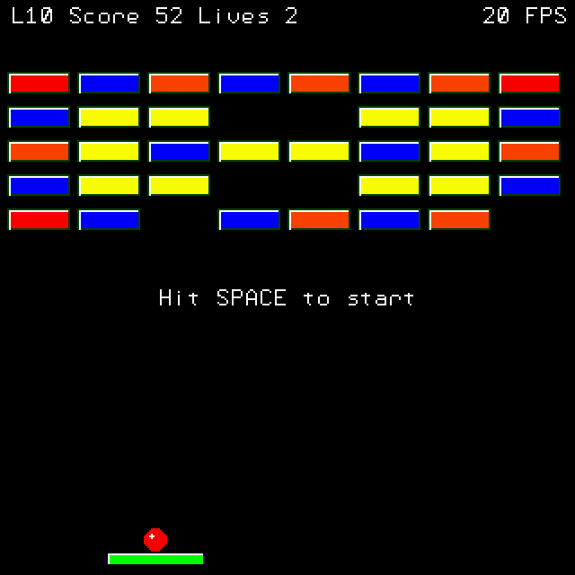

# Pico Blocks

A classic arcade breakout game written in MMBasic for the Raspberry Pi Pico (PicoMite). Features smooth 20+ FPS gameplay using hardware framebuffers, multiple block types, 10 progressive levels, and arcade-style physics.

## Gameplay



*Screenshot showing Level 1 with color-coded blocks: 🟥 Red (30pts), 🟧 Orange (20pts), 🟨 Yellow (10pts, 2 hits), 🟦 Blue (indestructible)*

## Features

- **Ball Launch System**: Ball follows paddle until spacebar pressed
- **Lives System**: 3 lives to complete all levels
- **Angle Variation**: Hit position on paddle affects ball trajectory (edges = sharper angles)
- **Multiple Block Types**:
  - Red: 30 points, 1 hit to destroy
  - Orange: 20 points, 1 hit to destroy
  - Yellow: 10 points, 2 hits to destroy (changes color when damaged)
  - Blue: Indestructible obstacles
- **10 Progressive Levels**: DATA-based layouts, easily editable
- **Explosion Animations**: Visual feedback when blocks are destroyed
- **Collision Timeout**: Prevents rapid repeated hits on same block
- **3D Visual Effects**: Highlights on paddle, ball, and blocks
- **Performance Optimized**: HUD only redraws on score/lives change

## Controls

- **Left Arrow**: Move paddle left
- **Right Arrow**: Move paddle right
- **Space**: Launch ball
- **P**: Save screenshot (saves as screen1.bmp, screen2.bmp, etc.)
- **ESC**: Quit game
- **1-8 Keys**: Play musical tones

## Level Design

Levels are defined using DATA statements at the top of the code. Each level uses a 5×8 grid:

```basic
' Level 1 - Easy warmup
DATA "0","0","0","0","0","0","0","0"
DATA "0","0","0","0","0","0","0","0"
DATA "0","0","R","R","R","R","0","0"
DATA "0","R","R","Y","Y","R","R","0"
DATA "R","R","R","R","R","R","R","R"
```

- `R` = Red block
- `O` = Orange block
- `Y` = Yellow block (2 hits)
- `B` = Blue block (indestructible)
- `0` = Empty space

To start at a specific level, change `currentLevel%=1` near the top of the code.

## Technical Details

Built using MMBasic's hardware framebuffer system for flicker-free rendering:
- Framebuffer F: Static background (blocks, HUD)
- Layer L: Dynamic sprites (paddle, ball)
- Continuous merge at ~26 FPS (38ms refresh)
- AABB collision detection with timeout system
- State-based explosion animations

---

## MMBasic Development Notes

### FRAMEBUFFER System

**Core Commands**
```basic
FRAMEBUFFER CREATE              ' Creates framebuffer F
FRAMEBUFFER LAYER RGB(BLACK)    ' Creates layer L, black = transparent
FRAMEBUFFER WRITE {N|F|L}       ' Direct output: N=display, F=framebuffer, L=layer
FRAMEBUFFER MERGE color [, mode] [, rate]  ' Composite F+L to display
FRAMEBUFFER SYNC                ' Wait for previous merge to complete
FRAMEBUFFER CLOSE               ' Cleanup
```

**Merge Modes**
- No mode: Single merge operation
- `R, rate`: Continuous merge at rate milliseconds (auto-refresh)
- `A`: Abort continuous merge

**Best Practices**
- F (framebuffer): Static background - drawn once
- L (layer): Dynamic sprites - redrawn each frame
- Transparent color in layer lets F show through
- Use FRAMEBUFFER SYNC before modifying L to prevent tearing
- Continuous merge with R mode works well for LCD displays
- Achieves ~20-26 FPS with proper usage

### MMBasic Syntax Notes

**Variable Declarations**
```basic
' LOCAL only allowed at start of SUB/FUNCTION
SUB MySub()
  LOCAL x%, y%   ' OK here
  x% = 5
  LOCAL z%       ' ERROR - not at start
END SUB

' Use global DIM for variables needed in DO loops
DIM FLOAT hitPos!, angle!
```

**Key Syntax Rules**
- `ELSE IF` (two words, not ELSEIF)
- `END IF`, `END SUB`, `END FUNCTION` (two words)
- Line continuation: `_` at end of line
- Comments: `'`

**Graphics Commands**
All respect current FRAMEBUFFER WRITE setting:
```basic
BOX x, y, w, h, line_width, , color
CIRCLE x, y, radius, line_width, aspect, , color
TEXT x, y, text$, justification, , , fg_color, bg_color
```

### Tools

**parse_pdf.py** - Python utility for searching PicoMite documentation:
```bash
python parse_pdf.py search "FRAMEBUFFER"
```